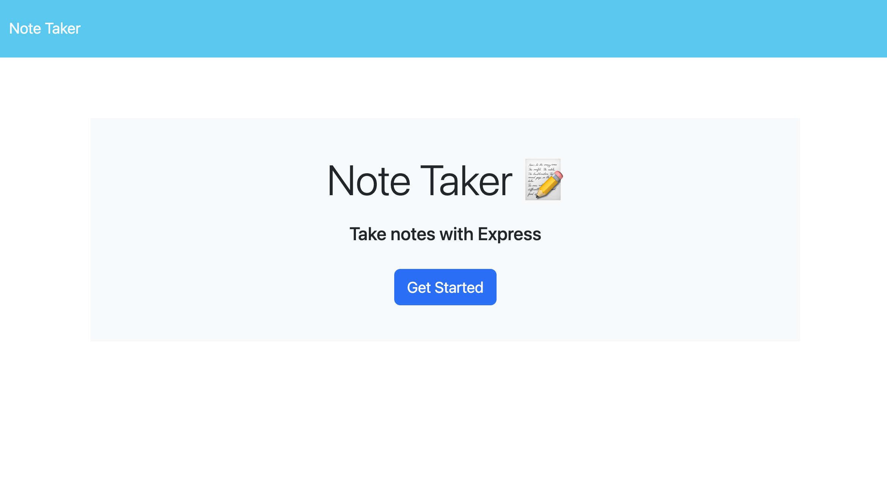
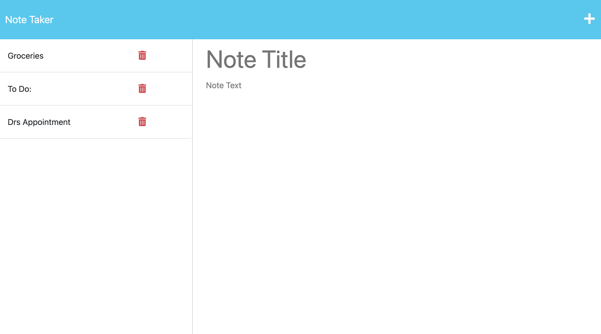

# 11-Express.js-Note-Taker

  
 
## Description
This application is called Note Taker and can be used to write and save notes. This application will use an Express.js back end and will save and retrieve note data from a JSON file.

  

## Project Link
Link to the Heroku App:
[Heroku App](https://notetakerapplication-week11.herokuapp.com/)
 
## Contributing
To contribute to this project please contact the developer.
 
## Credits
The project was created with the help of:
Front-end code created by edX Boot Camps LLC.
Back-end code (fsUtils and notes.delete request) created by edX Boot Camps LLC.

***
### Contact us
Contact our developer for any questions  
<JVN101@software.com>
